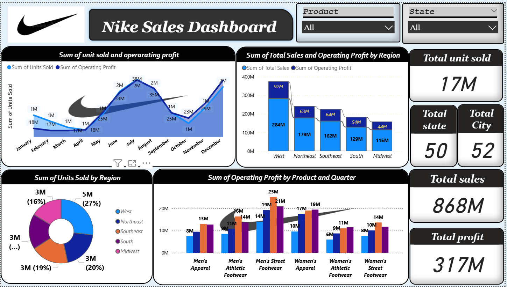

# 📊 Nike Sales Dashboard – Power BI Project
Power BI dashboard analyzing Nike's sales, profit, and performance across products, regions, and time.

## 📌 Project Overview
This Power BI project analyzes Nike’s sales and profit performance across different regions, product categories, and time periods. The interactive dashboard enables stakeholders to track KPIs, identify trends, and make data-driven decisions to boost sales and profitability.  

---

## 🎯 Objectives
- Analyze sales and operating profit trends over time.  
- Identify top-performing and underperforming regions.  
- Compare profitability across different product categories.  
- Support strategic decisions for marketing and inventory planning.  

---

## 🗂 Data Overview & Cleaning
**Dataset Includes:**  
- Product Category  
- Region  
- State & City  
- Units Sold  
- Total Sales  
- Operating Profit  
- Time Period (Monthly & Quarterly)  

**Data Cleaning Steps in Power Query:**  
- Removed duplicates & irrelevant columns.  
- Standardized product and region names.  
- Checked for and handled missing values.  
- Created calculated measures for KPIs (Total Sales, Total Profit, Units Sold).  

---

## 🛠 Tools Used
- **Power BI Desktop** – Data modeling, DAX calculations, and dashboard creation.  
- **Power Query** – Data cleaning and transformation.  
- **Excel/CSV** – Data source storage and preprocessing.  

---

## 📊 Dashboard Preview

  

---

## 📈 Key Insights
- **Total Units Sold:** 17M  
- **Total Sales:** 868M  
- **Total Profit:** 317M  
- **Best Region:** West (284M sales, 92M profit)  
- **Lowest Region:** Midwest (115M sales, 44M profit)  
- **Top Product:** Men’s Street Footwear (25M profit in Q3)  
- **Weakest Product:** Women’s Athletic Footwear (11M profit)  

---

## 💡 Recommendations
- Focus marketing in Midwest to boost sales and profits.  
- Improve promotion for Women’s Athletic Footwear category.  
- Replicate West region’s sales strategies in underperforming regions.  
- Leverage December sales momentum for year-end campaigns.  

---
---
**Author: Piryanka Jha 👩🏻‍💻** 
---
